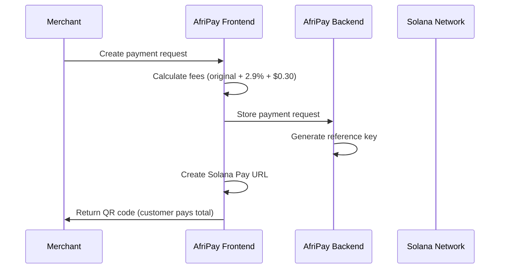
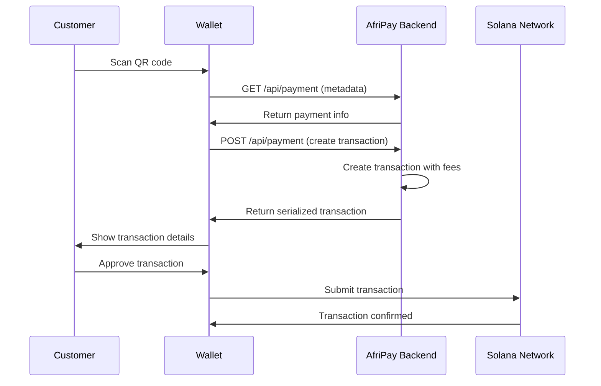
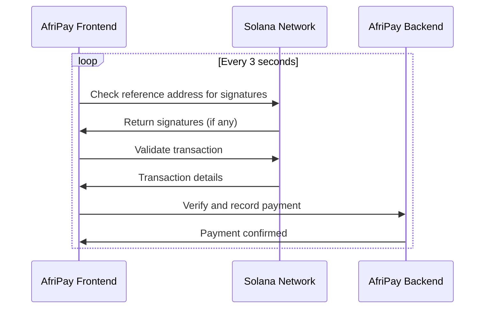

# AfriPay Solana Pay Implementation

This document explains how AfriPay implements the official [Solana Pay specification](https://docs.solanapay.com/) to provide seamless cryptocurrency payments with a Stripe-like fee structure.

## 🚀 Overview

AfriPay follows the official Solana Pay specification while adding a business model similar to Stripe:
- **Customer Experience**: Scan QR code, approve transaction in wallet
- **Merchant Experience**: Receive full requested amount (fees handled transparently)
- **AfriPay Revenue**: 2.9% + $0.30 fee per transaction (like Stripe)

## 📋 Solana Pay Specification Compliance

### Transfer Request URLs
Following [Transfer Request spec](https://docs.solanapay.com/spec#transfer-request):

```typescript
// Example Transfer Request URL
solana:9WzDXwBbmkg8ZTbNMqUxvQRAyrZzDsGYdLVL9zYtAWWM?amount=1.5&spl-token=EPjFWdd5AufqSSqeM2qN1xzybapC8G4wEGGkZwyTDt1v&reference=Hk9rQx5ZjAvrKCSjLnqtUoX7nZhEwrBMxAv1QoBp41R7&label=AfriPay%20Merchant&message=Coffee%20purchase%20(includes%200.05%20USDC%20AfriPay%20fee)
```

### Transaction Request URLs
Following [Transaction Request spec](https://docs.solanapay.com/spec#transaction-request):

```typescript
// Example Transaction Request URL
solana:https://api.afripay.com/api/payment?recipient=9WzDXwBbmkg8ZTbNMqUxvQRAyrZzDsGYdLVL9zYtAWWM&amount=1.5&reference=Hk9rQx5ZjAvrKCSjLnqtUoX7nZhEwrBMxAv1QoBp41R7
```

## 🏗️ Architecture

### Frontend Components

#### 1. SolanaPayService (`src/services/solanaPayService.ts`)
Core service implementing the official Solana Pay specification:

```typescript
import { solanaPayService } from '@/services/solanaPayService';

// Create a SOL payment
const payment = solanaPayService.createSOLPayment({
  recipient: new PublicKey('9WzDXwBbmkg8ZTbNMqUxvQRAyrZzDsGYdLVL9zYtAWWM'),
  amount: 1.5,
  label: 'Coffee Shop',
  message: 'Espresso and croissant'
});

// Create a USDC payment
const usdcPayment = solanaPayService.createUSDCPayment({
  recipient: new PublicKey('9WzDXwBbmkg8ZTbNMqUxvQRAyrZzDsGYdLVL9zYtAWWM'),
  amount: 25.00,
  label: 'Online Store',
  message: 'Product purchase'
});

// Monitor payment status
const status = await solanaPayService.monitorPayment(
  payment.reference,
  {
    recipient: new PublicKey('9WzDXwBbmkg8ZTbNMqUxvQRAyrZzDsGYdLVL9zYtAWWM'),
    amount: new BigNumber(1.5),
  }
);
```

#### 2. useSolanaPayOfficial Hook (`src/hooks/useSolanaPayOfficial.ts`)
React hook for managing payment state:

```typescript
import { useSolanaPayOfficial } from '@/hooks/useSolanaPayOfficial';

const PaymentComponent = () => {
  const {
    paymentState,
    createAndMonitorPayment,
    resetPayment,
    calculateFees
  } = useSolanaPayOfficial();

  const handlePayment = async () => {
    await createAndMonitorPayment({
      amount: 10.50,
      currency: 'USDC',
      label: 'My Store',
      message: 'Product purchase',
      customerEmail: 'customer@example.com'
    });
  };

  return (
    <div>
      {paymentState.status === 'pending' && (
        
      )}
      {paymentState.status === 'confirmed' && (
        <p>Payment confirmed! Signature: {paymentState.signature}</p>
      )}
    </div>
  );
};
```

### Backend Implementation

#### 1. Payment Metadata Endpoint
`GET /api/payment` - Returns payment information for wallet display:

```bash
curl "http://localhost:3001/api/payment?label=Coffee%20Shop&amount=5.50"
```

Response:
```json
{
  "label": "Coffee Shop",
  "icon": "http://localhost:3001/favicon.ico",
  "amount": 5.50
}
```

#### 2. Transaction Creation Endpoint
`POST /api/payment` - Creates transaction for wallet signing:

```bash
curl -X POST "http://localhost:3001/api/payment?recipient=9WzDXwBbmkg8ZTbNMqUxvQRAyrZzDsGYdLVL9zYtAWWM&amount=5.50&reference=Hk9rQx5ZjAvrKCSjLnqtUoX7nZhEwrBMxAv1QoBp41R7&spl-token=EPjFWdd5AufqSSqeM2qN1xzybapC8G4wEGGkZwyTDt1v" \
  -H "Content-Type: application/json" \
  -d '{"account": "5fNfvyp5T3BB9hJqpJ1L4V6LjdyNBz5Fz7VqjxP8qJSL"}'
```

Response:
```json
{
  "transaction": "AQAAAAAAAAAAAAAAAAAAAAAAAAAAAAAAAAAAAAAAAAAAAAAAAAAAAAAAAAAAAAAAAAAAAAAAAAAAAAAAAAAAAAAAAAAAAAAAAAAAAAAAAAAAAAAAAAAAAAAAAAAAAAAAAAAAAAAAAAAAAAAAAAAAAAAAAAAAAAAAAAAAAAAAAAAAAg==",
  "message": "Coffee purchase (includes 0.19 USDC AfriPay fee)"
}
```

## 💰 Fee Structure (Stripe-like Model)

### How Fees Work

1. **Merchant requests**: $10.00 USDC
2. **AfriPay calculates fees**: 
   - Percentage fee: $10.00 × 2.9% = $0.29
   - Fixed fee: $0.30
   - Total fee: $0.59
3. **Customer pays**: $10.59 USDC
4. **Merchant receives**: $10.00 USDC (full requested amount)
5. **AfriPay receives**: $0.59 USDC (fee)

### Fee Calculation

```typescript
const fees = solanaPayService.calculateAfriPayFees(10.00, 'USDC');
console.log(fees);
// {
//   originalAmount: 10.00,
//   afripayFee: 0.59,
//   merchantReceives: 10.00,
//   total: 10.59,
//   currency: 'USDC'
// }
```

## 🔄 Payment Flow

### 1. Payment Request Creation



### 2. Customer Payment



### 3. Payment Monitoring



## 🛠️ Implementation Examples

### Basic Payment Request

```typescript
import { solanaPayService } from '@/services/solanaPayService';

// Create a simple payment
const createPayment = () => {
  const payment = solanaPayService.createAfriPayPayment({
    merchantWallet: new PublicKey('9WzDXwBbmkg8ZTbNMqUxvQRAyrZzDsGYdLVL9zYtAWWM'),
    amount: 25.00,
    currency: 'USDC',
    description: 'Online course access',
    merchantName: 'EduPlatform',
    customerEmail: 'student@example.com'
  });

  console.log('Payment URL:', payment.paymentUrl);
  console.log('QR Code:', payment.qrCodeUrl);
  console.log('Customer pays:', payment.feeBreakdown.total, 'USDC');
  console.log('Merchant receives:', payment.feeBreakdown.merchantReceives, 'USDC');
};
```

### Advanced Payment with Monitoring

```typescript
import { useSolanaPayOfficial } from '@/hooks/useSolanaPayOfficial';

const AdvancedPayment = () => {
  const { paymentState, createAndMonitorPayment } = useSolanaPayOfficial();

  const handlePayment = async () => {
    try {
      const result = await createAndMonitorPayment({
        amount: 50.00,
        currency: 'USDC',
        label: 'Premium Subscription',
        message: 'Monthly premium plan',
        customerEmail: 'user@example.com',
        customerName: 'John Doe',
        memo: 'SUB-2024-001'
      });

      console.log('Payment created:', result);
    } catch (error) {
      console.error('Payment failed:', error);
    }
  };

  return (
    <div>
      <button onClick={handlePayment}>Create Payment</button>
      
      {paymentState.status === 'pending' && (
        <div>
          
          <p>Waiting for payment...</p>
        </div>
      )}
      
      {paymentState.status === 'confirmed' && (
        <div>
          <p>✅ Payment confirmed!</p>
          <p>Signature: {paymentState.signature}</p>
          <a 
            href={`https://explorer.solana.com/tx/${paymentState.signature}?cluster=devnet`}
            target="_blank"
          >
            View on Solana Explorer
          </a>
        </div>
      )}
    </div>
  );
};
```

## 🔍 Testing

### 1. Test Payment Creation

```bash
# Test payment metadata
curl "http://localhost:3001/api/payment?label=Test%20Store&amount=1.00"

# Test payment request creation
curl -X POST http://localhost:3001/api/create \
  -H "Content-Type: application/json" \
  -d '{
    "userId": "test-user",
    "amount": 1.00,
    "description": "Test payment",
    "recipientWallet": "9WzDXwBbmkg8ZTbNMqUxvQRAyrZzDsGYdLVL9zYtAWWM",
    "currency": "SOL"
  }'
```

### 2. Test with Phantom Wallet

1. Open the AfriPay frontend
2. Connect your Phantom wallet
3. Create a payment request
4. Scan the QR code with Phantom mobile
5. Approve the transaction
6. Verify payment confirmation

### 3. Monitor Transactions

```bash
# Check payment status
curl "http://localhost:3001/api/payment/status/Hk9rQx5ZjAvrKCSjLnqtUoX7nZhEwrBMxAv1QoBp41R7"

# Verify completed payment
curl -X POST http://localhost:3001/api/payment/verify \
  -H "Content-Type: application/json" \
  -d '{
    "signature": "5j7s1QjNeQJxvbxihg8CKaLQFFSWqSUBj9Cc3EMVUdnBkCxAqcb89sLrZdh4kkqjgvyFzfrAgE9gEFrsU2L7EqpG",
    "reference": "Hk9rQx5ZjAvrKCSjLnqtUoX7nZhEwrBMxAv1QoBp41R7"
  }'
```

## 🚀 Deployment

### Environment Variables

```bash
# Frontend (.env)
VITE_WEB3AUTH_CLIENT_ID=your_web3auth_client_id
VITE_SOLANA_NETWORK=devnet
VITE_SOLANA_RPC_URL=https://api.devnet.solana.com
VITE_USDC_MINT=4zMMC9srt5Ri5X14GAgXhaHii3GnPAEERYPJgZJDncDU
VITE_API_URL=http://localhost:3001

# Backend (.env)
SOLANA_NETWORK=devnet
RPC_ENDPOINT=https://api.devnet.solana.com
USDC_MINT=4zMMC9srt5Ri5X14GAgXhaHii3GnPAEERYPJgZJDncDU
AFRIPAY_PLATFORM_WALLET=EHwtMrGE6V5fH3xUKYcoHzbouUqfgB4jd7MsqfQfHVSn
AFRIPAY_FEE_RATE=0.029
AFRIPAY_FIXED_FEE_USD=0.30
```

### Production Checklist

- [ ] Switch to mainnet-beta network
- [ ] Use mainnet USDC mint: `EPjFWdd5AufqSSqeM2qN1xzybapC8G4wEGGkZwyTDt1v`
- [ ] Configure production RPC endpoint
- [ ] Set up proper SSL certificates
- [ ] Configure CORS for production domains
- [ ] Set up monitoring and alerting
- [ ] Test with real SOL/USDC on mainnet

## 📚 Resources

- [Official Solana Pay Documentation](https://docs.solanapay.com/)
- [Solana Pay GitHub Repository](https://github.com/solana-labs/solana-pay)
- [Solana Web3.js Documentation](https://solana-labs.github.io/solana-web3.js/)
- [SPL Token Documentation](https://spl.solana.com/token)

## 🤝 Contributing

1. Follow the official Solana Pay specification
2. Maintain backward compatibility
3. Add comprehensive tests
4. Update documentation
5. Test on devnet before mainnet deployment

## 📄 License

Same as main AfriPay project.
